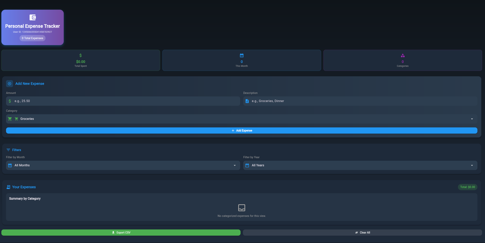

# Personal Expense Tracker

Minimalist Expense Tracker that allows users to add and track expenditures.

# Getting Started

Getting Started
To access the site use expensevercel.vercel.app
To run locally:

1. Clone the repository
git clone https://github.com/breeendon/expense.git
cd expense

2. Run the development server
npm run dev

3. Use the app!

